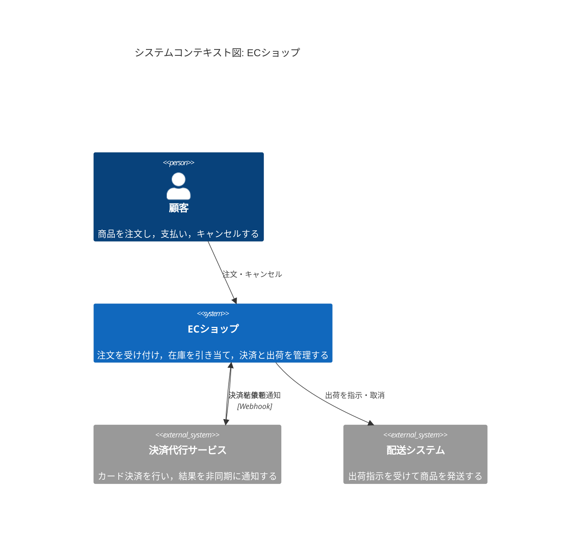
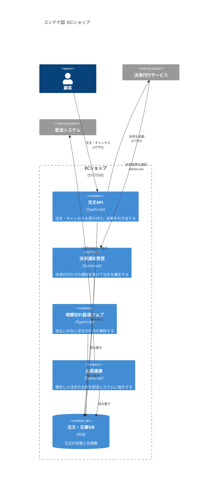

# ロードマップ

このハンズオンでは，ECショップの注文処理を題材に，Quintで仕様を書いてモデル検査する．
要求文をそのまま仕様にすると，シナリオのテストは通るのに，モデル検査が反例を出す．
反例から要求の抜けを読み取り，開発者として振る舞いを決め，要求文と仕様に書き戻す．
これを8回のIterationで繰り返し，最後は仕様から実装のテストを作るところまで進む．

## 題材：ECショップ

顧客が商品を注文すると，ECショップは在庫を引き当て，決済代行サービスに決済を依頼する．
決済の結果は後から通知で届く．
支払いのない注文は時間切れで引当を解除し，確定した注文は配送システムに出荷を指示する．

システムの構成は，はじめから最後まで次の図のとおりで変わらない．
Iterationごとに変わるのは，この中のどこまでをQuintでモデル化するかである．

### システムコンテキスト図



### コンテナ図



## 完成形の使い方

最後のIterationを終えると，次のコマンドで仕様・図・実装の整合性をまとめて確かめられる．

```sh
mise run check
```

内部では，次を順に実行する．

| コマンド | 確かめること |
| --- | --- |
| `quint test shop_test.qnt` | 要求文に書かれたシナリオどおりに動くか |
| `quint run shop.qnt --invariant=...` | ランダムな実行で，不変条件が破れないか |
| `quint verify shop.qnt ...` | すべての実行で，不変条件と活性が成り立つか |
| 状態遷移図の生成 | トレースから作り直した図が，コミット済みの図と一致するか |
| 性質名の照合 | 要求文が参照する性質名と，`shop.qnt`の性質が一致するか |
| `pnpm vitest` | Quintのトレースを流したとき，TypeScriptの実装が仕様どおりに動くか |

Iteration 0で受講者が出会う反例の例を示す．
要求文の例をテストにした`quint test`は通るが，`quint run`は在庫が-1になる実行を見つける．

```text
$ quint test shop_test.qnt

  shop_test
    ok placeOneOrderTest passed 1 test(s)

  1 passing (18ms)

$ quint run shop.qnt --invariant=invStockNonNegative --max-samples=1000 --seed=1
An example execution:

[State 0] { orderStatus: Map("o1" -> NotPlaced, "o2" -> NotPlaced), stock: 1 }

[State 1] { orderStatus: Map("o1" -> Reserved, "o2" -> NotPlaced), stock: 0 }

[State 2] { orderStatus: Map("o1" -> Reserved, "o2" -> Reserved), stock: -1 }

[violation] Found an issue (15ms at 67 traces/second).
Use --verbosity=3 to show executions.
Use --seed=0x1 --backend=rust to reproduce.
error: Invariant violated
```

## Iterationの進め方

どのIterationも，次の順に進める．

1. 要求文を読む．`requirements.md`に，そのIterationで追加する機能の要求が書かれている．
2. シナリオのテストを書く．要求文に書かれた例を，`quint test`のテストにする．
3. 仕様と性質を書く．状態とアクションを`shop.qnt`に書き，要求文から読み取れる性質(不変条件・活性)を加える．
4. 検査して反例を読む．`quint run`と`quint verify`で検査する．反例が出たら，どの手順で何が起きたかを読み取る．
5. 振る舞いを決めて書き戻す．反例の状況でシステムがどう振る舞うべきかを開発者として決める．決めた内容を要求文に書き足し，それを保証する性質名を添える．
6. 仕様を直して検査を通す．`shop.qnt`とテストを直し，`mise run check`が通るまで繰り返す．状態遷移図は自動で作り直される．

各Iterationで必要になる形式手法の基礎知識は，`docs/concepts/`にまとめてある．
Iterationを始める前に，`docs/concepts/README.md`でそのIterationの概念を確かめ，読んでおく．

各Iterationの`exercise/`は，前のIterationの`solution/`と同じ内容から始まる．
`solution/`には，模範となる要求文・仕様・テスト・状態遷移図がある．

## テストと検査の分担

| 手段 | 置き場所 | 役割 |
| --- | --- | --- |
| シナリオのテスト(`quint test`) | `shop_test.qnt` | 要求文に書かれた具体的な手順を確かめる．書いた手順しか調べない |
| ランダムシミュレーション(`quint run`) | `shop.qnt`の性質 | 多数のランダムな実行で性質を調べる．反例をすばやく見つける |
| モデル検査(`quint verify`) | `shop.qnt`の性質 | 定数で決めた範囲のすべての実行で性質を調べる．活性もここで調べる |
| 実装のテスト(Vitest) | `impl/` (Iteration 7) | Quintのトレースを実装に流し，実装が仕様と同じ状態を通るかを調べる |

## Iterationの一覧

| # | 追加する機能 | モデル化する範囲(コンテナ図) | 学ぶこと |
| --- | --- | --- | --- |
| 0 | 注文と在庫の引当 | 注文API，注文・在庫DB | 状態・アクション・不変条件，反例の読み方 |
| 1 | 複数の顧客が同時に注文する | 注文API，注文・在庫DB | 非決定的な選択，割り込み(インターリーブ) |
| 2 | 決済と時間切れ | ＋決済代行サービス，決済通知受信，時間切れ監視ジョブ | 外部システムのモデル化，非同期の通知 |
| 3 | 決済の再試行と通知の重複 | 同上 | メッセージの重複・遅延，冪等性 |
| 4 | 注文が必ず決着する | 同上 | 活性，公平性，`quint verify` |
| 5 | キャンセルと出荷 | ＋出荷連携，配送システム | システム間の結果整合性，補償処理 |
| 6 | 複数商品の注文 | 全体 | 抽象化，状態爆発，定数の選び方 |
| 7 | 仕様から実装のテストを作る | 注文APIの実装 | ITFトレース，モデルベーステスト，CIへの組み込み |

## Iteration 0: 注文を受け付けて在庫を引き当てる

受講者に渡す要求文は，次のとおり．

- 顧客は商品を1個注文できる．
- 注文を受け付けると，在庫を1個引き当てる．
- 例：在庫が1個のとき，注文を1件受け付けると在庫は0個になる．

| 項目 | 内容 |
| --- | --- |
| 仕様の変更 | 在庫数と注文の状態を変数にし，注文を受け付けるアクションを作る．性質「在庫は負にならない」を加える． |
| 状態遷移図 | 注文の状態(未注文，引当済み，お断り)の図が初めて生成される． |
| 基礎知識 | 状態遷移系，不変条件，テスト・シミュレーション・モデル検査． |
| 学ぶこと | `var`，`action`，`init`と`step`，不変条件，`quint`の各コマンド，反例の読み方． |
| 既存テストへの影響 | なし(最初のIteration)． |
| 受講者のツール操作 | `mise run check`と，`quint run`の主なオプションを初めて使う． |

## Iteration 1: 複数の顧客が同時に注文する

受講者に渡す要求文は，次のとおり．

- 複数の顧客が同時に注文できる．
- 注文APIは，在庫を確かめてから引き当てる．
- 例：在庫が1個のとき，Aさんの注文を受け付けたあと，Bさんの注文は断る．

| 項目 | 内容 |
| --- | --- |
| 仕様の変更 | 顧客の集合を定数にし，在庫の確認と引当を別々のアクションに分ける． |
| 状態遷移図 | 「確認済み」の状態が加わる． |
| 基礎知識 | 非決定性，インターリーブと原子性，デッドロック． |
| 学ぶこと | 集合，`nondet`と`oneOf`，`mapBy`，インターリーブ，デッドロックと正常な終わりの見分け方． |
| 既存テストへの影響 | 引当が2段階になるため，Iteration 0のシナリオのテストの手順が変わる． |
| 受講者のツール操作 | `--max-samples`でシミュレーションの回数を変える． |

## Iteration 2: 決済と時間切れ

受講者に渡す要求文は，次のとおり．

- 在庫を引き当てたら，決済代行サービスに決済を依頼する．
- 決済の結果は決済代行サービスから通知で届く．成功なら注文を確定し，失敗なら引当を解除する．
- 一定時間内に決済の結果が届かない注文は，時間切れ監視ジョブが引当を解除する．

| 項目 | 内容 |
| --- | --- |
| 仕様の変更 | 決済代行サービスと通知をモデル化する．時間は「時間切れが起きうる」というアクションとして抽象化する． |
| 状態遷移図 | 「決済待ち」「確定」「時間切れ」の状態が加わる． |
| 基礎知識 | 環境のモデル化，非同期メッセージ，時間の抽象化． |
| 学ぶこと | 外部システムを状態として表す方法，通知(メッセージ)の集合，時間の抽象化． |
| 既存テストへの影響 | 引当のあとに決済の手順が入るため，シナリオのテストの終わりの状態が変わる． |
| 受講者のツール操作 | 仕様が大きくなるので，`quint`のREPLで状態を1手ずつ動かして確かめる． |

## Iteration 3: 決済の再試行と通知の重複

受講者に渡す要求文は，次のとおり．

- 決済の依頼に応答がないとき，注文APIは決済を再試行する．
- 決済代行サービスは，同じ結果を複数回通知することがある．

| 項目 | 内容 |
| --- | --- |
| 仕様の変更 | 通知の重複と，依頼の再送をアクションとして加える． |
| 状態遷移図 | 再試行による遷移が加わる． |
| 基礎知識 | メッセージの配送保証，冪等性． |
| 学ぶこと | 少なくとも1回届くメッセージのモデル化，冪等性を性質として書く方法． |
| 既存テストへの影響 | 通知の扱いが変わるため，Iteration 2の決済のテストの期待値が変わる． |
| 受講者のツール操作 | なし． |

## Iteration 4: 注文が必ず決着する

受講者に渡す要求文は，次のとおり．

- 支払いを済ませた注文は，いずれ確定するか返金される．
- 注文は，いつまでも決済待ちのままにはならない．

| 項目 | 内容 |
| --- | --- |
| 仕様の変更 | 活性を時相論理の性質として加え，時間切れ監視ジョブや通知に公平性を仮定する． |
| 状態遷移図 | 変化なし． |
| 基礎知識 | 安全性と活性，時相論理，公平性，有界モデル検査と全状態探索． |
| 学ぶこと | 安全性と活性の違い，`always`と`eventually`，公平性の仮定，`quint verify`による網羅的な検査． |
| 既存テストへの影響 | なし． |
| 受講者のツール操作 | `quint verify`を初めて使い，`--temporal`で活性を指定する． |

## Iteration 5: キャンセルと出荷

受講者に渡す要求文は，次のとおり．

- 顧客は，出荷されるまで注文をキャンセルできる．キャンセルした注文は返金する．
- 確定した注文は，出荷連携が配送システムに出荷を指示する．

| 項目 | 内容 |
| --- | --- |
| 仕様の変更 | キャンセルと出荷のアクション，配送システムの状態，両システム間の指示と応答を加える． |
| 状態遷移図 | 「出荷指示済み」「取消依頼中」「キャンセル済み」「出荷済み」の状態が加わる． |
| 基礎知識 | 結果整合性，補償処理． |
| 学ぶこと | 2つのシステムの状態が途中で食い違っても，いずれ一致することを活性として書く方法(結果整合性)．取消依頼と補償処理のモデル化． |
| 既存テストへの影響 | 確定のあとに出荷が続くため，確定で終わっていたシナリオのテストの期待値が変わる． |
| 受講者のツール操作 | なし． |

## Iteration 6: 複数商品の注文

受講者に渡す要求文は，次のとおり．

- 1件の注文に，複数の商品をそれぞれ複数個含められる．

| 項目 | 内容 |
| --- | --- |
| 仕様の変更 | 在庫を商品ごとに持ち，注文を商品と個数の組の集合にする．検査にかかる時間を見ながら，定数(商品数・顧客数・在庫数)を選ぶ． |
| 状態遷移図 | 変化なし(注文単位の状態は同じ)． |
| 基礎知識 | 抽象化，状態爆発と小スコープ仮説． |
| 学ぶこと | 抽象化(何をモデルにして何を捨てるか)，状態爆発，小さな定数で十分な理由． |
| 既存テストへの影響 | 注文の型が変わるため，すべてのシナリオのテストで注文の書き方が変わる． |
| 受講者のツール操作 | 定数を変えた仕様を別のモジュールとして用意し，`quint verify`の時間を比べる． |

## Iteration 7: 仕様から実装のテストを作る

受講者に渡す要求文はない．Iteration 6までに決めた要求文を，そのまま使う．

注文処理の状態遷移を，TypeScriptの純粋な関数として実装する．
Quintの1つのアクションが，1つの関数に対応する．
関数は現在の状態と引数を受け取り，次の状態を返す．
外部システムへの指示(決済依頼・出荷指示・取消依頼)は，送るべきメッセージとして状態に積む．

```text
impl/
  src/
    state.ts        状態の型(在庫，注文ごとの状態，外部システムへの指示)
    actions.ts      アクションごとの関数(次の状態を返す)
  test/
    itf.ts          ITF形式のJSONをTypeScriptの値に変換する
    trace.test.ts   Quintのトレースを1ステップずつ実装に流し，状態を比べる
```

`trace.test.ts`は，トレースの各ステップで次を行う．

1. `mbt::actionTaken`と`mbt::nondetPicks`から，呼ぶ関数と引数を決める．
2. 実装の関数を呼び，次の状態を得る．
3. 得た状態が，トレースの次の状態と一致するかを確かめる．

Quintでは，1つのアクションを割り込まれない1手として扱った．
実際のシステムでは，この前提をDBのトランザクションなどで守る必要がある．
これは，仕様が実装に課す前提として`requirements.md`に書く．

| 項目 | 内容 |
| --- | --- |
| 仕様の変更 | なし． |
| 基礎知識 | モデルベーステスト，仕様と実装の対応(詳細化)． |
| 学ぶこと | トレースの出力，ITF形式，モデルベーステスト，CIでの実行． |
| 既存テストへの影響 | なし．`impl/`にVitestのテストを加える． |
| 受講者のツール操作 | `pnpm add -D vitest`でテストの道具を加え，`pnpm vitest`で実行する． |
