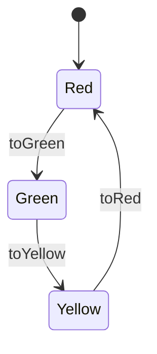

# 状態遷移系

## 一言でいうと

システムを「状態」と「状態を変える操作(遷移)」の組として表したものである．
モデル検査は，システムを状態遷移系として書き，その振る舞いを調べる．

## 構成要素

| 要素 | 意味 | 信号機の例 |
| --- | --- | --- |
| 状態変数 | システムの状態を表す変数 | `light`(信号の色) |
| 状態 | すべての状態変数に値を割り当てたもの | `light`が`Red`である状態 |
| 初期状態 | システムが動き始めるときの状態 | `light`が`Red` |
| 遷移 | ある状態から次の状態への変化．起きてよい条件と，変化の内容からなる | 赤のときに限り，青に変わる |
| 実行 | 初期状態から始まり，遷移でつながった状態の列 | 赤→青→黄→赤→… |

信号機の状態遷移系を図にすると，次のようになる．

## 遷移の条件と変化

遷移は，次の2つからなる．

- 条件(ガード)：その遷移が起きてよい状態を決める．条件を満たさない状態では，その遷移は起きない．
- 変化：遷移のあとで，各状態変数がどの値になるかを決める．

たとえば`toYellow`は，「`light`が`Green`のとき」という条件と，「`light`を`Yellow`にする」という変化からなる．
条件を書き忘れると，赤から黄に変わるような，要求にない遷移も起きうる仕様になる．

## 実行とトレース

ある状態で起きうる遷移が複数あるとき，実行はどの遷移を選んでもよい．
そのため，1つの状態遷移系から，多くの実行が生まれる．

実行を記録した状態の列を，トレースと呼ぶ．
反例も，性質が破れるところまでのトレースである．

## なぜ必要か

要求文は「注文すると在庫が減る」のように，1つの操作ごとに書かれることが多い．
状態遷移系として書くと，操作がどんな順番で起きても，システムがどの状態になりうるかを調べられる．
要求文を1つずつ読むだけでは気づかない，操作の組み合わせによる問題が見えるようになる．

## テストとの違い

テストは，決まった1つの実行を動かして結果を確かめる．
状態遷移系を調べると，仕様から生まれるすべての実行が対象になる．

## よくある誤解

- 状態遷移系は，実装のクラスや関数の構造を写したものではない．要求を満たすかを調べるのに必要な状態だけを書く．
- 遷移は「呼び出される関数」ではない．条件を満たしていれば，いつ起きてもよい出来事である．

## Quintでの書き方

- 状態変数は`var`，初期状態は`action init`，遷移は`action`で書く．
- 実行の各段階で起こりうる遷移を，`action step`にまとめる．

構文は[Iteration 0の構文の解説](../quint/iteration-0.md)を参照する．
