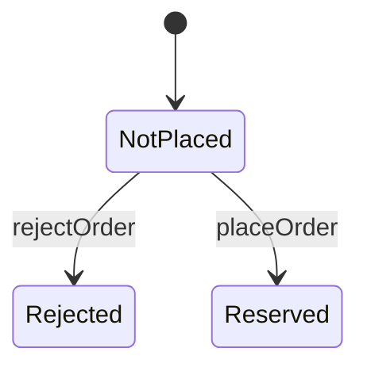

# Iteration 0：注文と在庫の引当(解説)

課題の各段階について，模範解答とその考え方を示す．

## 0-1 準備

課題のディレクトリは，はじめから検査を通る．
仕様に性質がなく，要求文も性質名を参照していないので，性質名の照合とモデル検査は何も調べずに通る．

## 0-2 基礎知識と構文

REPLの課題の答えを示す．

1. `set`は，1つのキーの値を変えた新しいマップを返す．

   ```text
   >>> Map("apple" -> 1, "banana" -> 2).set("banana", 3)
   Map("apple" -> 1, "banana" -> 3)
   ```

2. `set`で作ったマップに，続けて`get`を使える．

   ```text
   >>> type Seat = Free | Taken
   >>> Map("s1" -> Free, "s2" -> Free).set("s1", Taken).get("s1") == Taken
   true
   ```

3. 1回目の`sell`は，残りが1枚あるので条件を満たし，`true`になる．
   2回目は，残りが0枚で条件`tickets > 0`を満たさないので，遷移は起きず`false`になる．
   遷移が起きなかったので，`tickets`は0のままである．

   ```text
   >>> var tickets: int
   >>> action init = tickets' = 1
   >>> action sell = all { tickets > 0, tickets' = tickets - 1 }
   >>> init
   true
   >>> sell
   true
   >>> tickets
   0
   >>> sell
   false
   >>> tickets
   0
   ```

## 0-3 シナリオのテスト

要求文の例を，そのままテストにする．
在庫が1個の初期状態から，注文`"o1"`を受け付けたあと，在庫が0個で注文が`Reserved`になっていることを確かめる．

```quint
// 要求文の例をシナリオのテストにしたもの．
module shop_test {
  import shop.* from "./shop"

  // 在庫が1個のとき，注文を1件受け付けると在庫は0個になる．
  run placeOneOrderTest =
    init
      .then(placeOrder("o1"))
      .expect(stock == 0 and orderStatus.get("o1") == Reserved)
}
```

仕様は，要求文をそのまま書く．
`placeOrder`は，まだ注文していない注文について，在庫を1個減らし，注文を`Reserved`にする．

```quint
// ECショップの注文処理の仕様．
module shop {
  // 注文の状態．
  type OrderStatus = NotPlaced | Reserved

  // はじめの在庫数．
  pure val INITIAL_STOCK = 1

  // 在庫数．
  var stock: int
  // 注文ごとの状態．注文は"o1"と"o2"の2件を考える．
  var orderStatus: str -> OrderStatus

  action init = all {
    stock' = INITIAL_STOCK,
    orderStatus' = Map("o1" -> NotPlaced, "o2" -> NotPlaced),
  }

  // 注文を受け付け，在庫を1個引き当てる．
  action placeOrder(order: str): bool = all {
    orderStatus.get(order) == NotPlaced,
    stock' = stock - 1,
    orderStatus' = orderStatus.set(order, Reserved),
  }

  action step = any {
    placeOrder("o1"),
    placeOrder("o2"),
  }
}
```

テストは通る．

```text
$ quint test shop_test.qnt

  shop_test
    ok placeOneOrderTest passed 1 test(s)

  1 passing (18ms)
```

## 0-4 性質

要求文は在庫の範囲を書いていないが，在庫が負になることはありえない．
これを不変条件`invStockNonNegative`として`shop.qnt`に加える．

```quint
  // 在庫は負にならない．
  val invStockNonNegative = stock >= 0
```

## 0-5 検査と反例

ランダムシミュレーションは，すぐに反例を見つける．

```text
$ quint run shop.qnt --invariant=invStockNonNegative --max-samples=1000 --seed=1
An example execution:

[State 0] { orderStatus: Map("o1" -> NotPlaced, "o2" -> NotPlaced), stock: 1 }

[State 1] { orderStatus: Map("o1" -> Reserved, "o2" -> NotPlaced), stock: 0 }

[State 2] { orderStatus: Map("o1" -> Reserved, "o2" -> Reserved), stock: -1 }

[violation] Found an issue (15ms at 67 traces/second).
Use --verbosity=3 to show executions.
Use --seed=0x1 --backend=rust to reproduce.
error: Invariant violated
```

モデル検査も，同じ長さの反例を示す．注文の順番は逆だが，起きていることは同じである．

```text
$ quint verify shop.qnt --invariants invStockNonNegative
An example execution:

[State 0] { orderStatus: Map("o1" -> NotPlaced, "o2" -> NotPlaced), stock: 1 }

[State 1] { orderStatus: Map("o1" -> NotPlaced, "o2" -> Reserved), stock: 0 }

[State 2] { orderStatus: Map("o1" -> Reserved, "o2" -> Reserved), stock: -1 }

[violation] Found an issue (4644ms).
error: found a counterexample
```

問いへの答えは次のとおりである．

1. 最後の状態で，`stock`が`-1`になっている．
2. 1件目の注文を受け付けて在庫が0個になり，続けて2件目の注文を受け付けた．
3. 要求文は「注文を受け付けると在庫を引き当てる」とだけ書き，在庫がないときの注文をどう扱うかを決めていない．

0-3のテストは，注文を1件受け付けるだけの手順である．
在庫が尽きたあとの注文という手順をテストに書かなかったので，テストは通った．
不変条件は，どの手順で到達した状態でも調べるので，テストに書かなかった手順の問題も見つかる．

## 0-6 決定と反映

在庫が0個のときの注文は断ると決める．
`requirements.md`の決定事項に，この振る舞いと，それを保証する不変条件の名前を書く．

```markdown
## 決定事項

### Iteration 0

- 在庫が0個のときの注文は断る．在庫は負にならない．(性質：invStockNonNegative)
```

仕様では，注文を断った状態`Rejected`と，注文を断るアクション`rejectOrder`を加える．
`placeOrder`には，在庫があるという条件`stock > 0`を加える．

```quint
  // 注文の状態．
  type OrderStatus = NotPlaced | Reserved | Rejected
```

```quint
  // 在庫があれば注文を受け付け，在庫を1個引き当てる．
  action placeOrder(order: str): bool = all {
    orderStatus.get(order) == NotPlaced,
    stock > 0,
    stock' = stock - 1,
    orderStatus' = orderStatus.set(order, Reserved),
  }

  // 在庫がなければ注文を断る．
  action rejectOrder(order: str): bool = all {
    orderStatus.get(order) == NotPlaced,
    stock == 0,
    stock' = stock,
    orderStatus' = orderStatus.set(order, Rejected),
  }

  action step = any {
    placeOrder("o1"),
    placeOrder("o2"),
    rejectOrder("o1"),
    rejectOrder("o2"),
  }
```

決めた振る舞いを確かめるテストを加える．

```quint
  // 在庫が0個のとき，注文は断られ，在庫は0個のままである．
  run rejectWhenOutOfStockTest =
    init
      .then(placeOrder("o1"))
      .then(rejectOrder("o2"))
      .expect(stock == 0 and orderStatus.get("o2") == Rejected)
```

状態遷移図を生成し直すと，次の図になる．
注文は`NotPlaced`から始まり，`placeOrder`で`Reserved`に，`rejectOrder`で`Rejected`に変わる．



すべての検査が通る．

```text
$ mise run verify iterations/iteration-0/exercise
[install] $ pnpm install --frozen-lockfile
✓ Lockfile passes supply-chain policies (verified 2m ago)
Lockfile is up to date, resolution step is skipped
Done in 20ms using pnpm v12.6.0
[verify] $ node tools/check.ts iterations/iteration-0/exercise
ok  Quintの評価器とApalache

iterations/iteration-0/exercise
ok  quint typecheck
ok  quint test
ok  性質名の照合
ok  quint verify
ok  状態遷移図
Finished in 8.52s
```

決定事項に性質名を書き忘れると，性質名の照合が次のように失敗する．

```text
NG  性質名の照合
      shop.qntのinvStockNonNegativeを，requirements.mdのどの決定事項も参照していない．
```

## 0-7 振り返り

1. 「在庫がなければ注文を断る」以外に，「在庫がなければ入荷を待つ」と決めることもできる．
   その場合は，入荷を表すアクションや，入荷待ちの状態が必要になる．
   どちらを選んでも，決定事項と性質と仕様が一致していればよい．
2. テストは，書いた手順しか調べない．要求文の例は注文が1件の手順なので，在庫が尽きたあとの注文は調べなかった．
3. 「在庫を引き当てる」という文は，引き当てる在庫の存在を前提にしている．
   要求文を書く人は，自分にとって当然のことを要求文に書かない．当然のことを性質として書くと，その前提を崩す手順が見つかる．
4. 図の遷移は，`placeOrder`と`rejectOrder`の2つである．注文を取り消す遷移はなく，要求文にも取り消しはない．
   Iteration 5では，キャンセルの要求を加える．

## 0-8 発展課題

注文の個数を`placeOrder`の引数に加え，在庫が1個の状態で2個の注文を受け付けると，`invStockNonNegative`が破れる．
0-6の条件`stock > 0`は，「在庫が1個でもあれば受け付ける」という意味になっていたことが分かる．
在庫が注文の個数に足りないときの振る舞い(断る，または在庫の分だけ受け付ける)を決め，条件を`stock >= 個数`のように直す．
