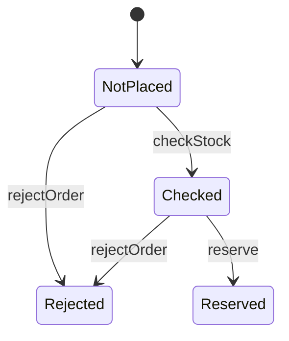

# Iteration 1：複数の顧客が同時に注文する(解説)

課題の各段階について，模範解答とその考え方を示す．

## 1-1 準備

課題のディレクトリの仕様は，Iteration 0の模範解答と同じなので，検査を通る．
Iteration 1の要求文は性質名を参照しないので，性質名の照合も通る．

## 1-2 基礎知識と構文

REPLの課題の答えを示す．

1. `mapBy`で，各要素を同じ値に対応させる．

   ```text
   >>> Set("a", "b", "c").mapBy(_ => false)
   Map("a" -> false, "b" -> false, "c" -> false)
   ```

2. `map`で1を足した集合`Set(2, 3, 4)`は，`4`を含む．

   ```text
   >>> Set(1, 2, 3).map(x => x + 1).contains(4)
   true
   ```

3. 1回目の`take`では，`"alice"`か`"bob"`のどちらかが座席を取る．どちらになるかは実行ごとに変わる．
   2回目は，座席が空いていないので条件を満たさず，`false`になる．

   ```text
   >>> var seat: str
   >>> action init = seat' = "none"
   >>> action take = { nondet who = Set("alice", "bob").oneOf() all { seat == "none", seat' = who } }
   >>> init
   true
   >>> take
   true
   >>> seat
   "bob"
   >>> take
   false
   ```

## 1-3 シナリオのテスト

要求文の「在庫を確かめてから引き当てる」を，`checkStock`と`reserve`の2つのアクションにする．
`step`では，注文を非決定的に選び，その注文に起きうるアクションを並べる．
Iteration 0の不変条件は，そのまま残す．

```quint
// ECショップの注文処理の仕様．
module shop {
  // 注文の状態．
  type OrderStatus = NotPlaced | Checked | Reserved | Rejected

  // はじめの在庫数．
  pure val INITIAL_STOCK = 1
  // 注文．顧客ごとに1件ずつ注文する．
  pure val ORDERS = Set("o1", "o2")

  // 在庫数．
  var stock: int
  // 注文ごとの状態．
  var orderStatus: str -> OrderStatus

  action init = all {
    stock' = INITIAL_STOCK,
    orderStatus' = ORDERS.mapBy(_ => NotPlaced),
  }

  // 在庫があることを確かめる．
  action checkStock(order: str): bool = all {
    orderStatus.get(order) == NotPlaced,
    stock > 0,
    stock' = stock,
    orderStatus' = orderStatus.set(order, Checked),
  }

  // 在庫を1個引き当てる．
  action reserve(order: str): bool = all {
    orderStatus.get(order) == Checked,
    stock' = stock - 1,
    orderStatus' = orderStatus.set(order, Reserved),
  }

  // 在庫がなければ注文を断る．
  action rejectOrder(order: str): bool = all {
    orderStatus.get(order) == NotPlaced,
    stock == 0,
    stock' = stock,
    orderStatus' = orderStatus.set(order, Rejected),
  }

  action step = {
    nondet order = ORDERS.oneOf()
    any {
      checkStock(order),
      reserve(order),
      rejectOrder(order),
    }
  }

  // 在庫は負にならない．
  val invStockNonNegative = stock >= 0
}
```

`placeOrder`を`checkStock`と`reserve`に分けたので，Iteration 0の2つのテストの手順を直す．
`rejectWhenOutOfStockTest`は，要求文の例(Aさんの注文を受け付けたあと，Bさんの注文を断る)と同じ手順である．

```quint
// 要求文の例をシナリオのテストにしたもの．
module shop_test {
  import shop.* from "./shop"

  // 在庫が1個のとき，注文を1件受け付けると在庫は0個になる．
  run placeOneOrderTest =
    init
      .then(checkStock("o1"))
      .then(reserve("o1"))
      .expect(stock == 0 and orderStatus.get("o1") == Reserved)

  // 在庫が1個のとき，Aさんの注文を受け付けたあと，Bさんの注文は断る．
  run rejectWhenOutOfStockTest =
    init
      .then(checkStock("o1"))
      .then(reserve("o1"))
      .then(rejectOrder("o2"))
      .expect(stock == 0 and orderStatus.get("o2") == Rejected)
}
```

```text
$ quint test shop_test.qnt

  shop_test
    ok placeOneOrderTest passed 1 test(s)
    ok rejectWhenOutOfStockTest passed 1 test(s)

  2 passing (22ms)
```

## 1-4 性質

守りたいことは，Iteration 0と同じく「在庫は負にならない」である．
新しい要求は，在庫を減らす手順を変えただけで，守るべきことは変えていない．
既存の不変条件が，新しい手順でも守られるかを検査する．

## 1-5 検査と反例

`--max-samples=1`では，反例を含まない実行が1つ作られただけで終わる．

```text
$ quint run shop.qnt --invariant=invStockNonNegative --max-samples=1 --seed=1
An example execution:

[State 0] { orderStatus: Map("o1" -> NotPlaced, "o2" -> NotPlaced), stock: 1 }

[State 1] { orderStatus: Map("o1" -> Checked, "o2" -> NotPlaced), stock: 1 }

[State 2] { orderStatus: Map("o1" -> Reserved, "o2" -> NotPlaced), stock: 0 }

[State 3] { orderStatus: Map("o1" -> Reserved, "o2" -> Rejected), stock: 0 }

[ok] No violation found (15ms at 67 traces/second).
Trace length statistics: max=4, min=4, average=4.00
You may increase --max-samples and --max-steps.
Use --verbosity to produce more (or less) output.
Use --seed=0x1 --backend=rust to reproduce.
```

実行の数を増やすと，反例が見つかる．

```text
$ quint run shop.qnt --invariant=invStockNonNegative --max-samples=1000 --seed=1
An example execution:

[State 0] { orderStatus: Map("o1" -> NotPlaced, "o2" -> NotPlaced), stock: 1 }

[State 1] { orderStatus: Map("o1" -> NotPlaced, "o2" -> Checked), stock: 1 }

[State 2] { orderStatus: Map("o1" -> Checked, "o2" -> Checked), stock: 1 }

[State 3] { orderStatus: Map("o1" -> Reserved, "o2" -> Checked), stock: 0 }

[State 4] { orderStatus: Map("o1" -> Reserved, "o2" -> Reserved), stock: -1 }

[violation] Found an issue (14ms at 143 traces/second).
Use --verbosity=3 to show executions.
Use --seed=0x14 --backend=rust to reproduce.
error: Invariant violated
```

```text
$ quint verify shop.qnt --invariants invStockNonNegative
An example execution:

[State 0] { orderStatus: Map("o1" -> NotPlaced, "o2" -> NotPlaced), stock: 1 }

[State 1] { orderStatus: Map("o1" -> NotPlaced, "o2" -> Checked), stock: 1 }

[State 2] { orderStatus: Map("o1" -> Checked, "o2" -> Checked), stock: 1 }

[State 3] { orderStatus: Map("o1" -> Checked, "o2" -> Reserved), stock: 0 }

[State 4] { orderStatus: Map("o1" -> Reserved, "o2" -> Reserved), stock: -1 }

[violation] Found an issue (5011ms).
error: found a counterexample
```

問いへの答えは次のとおりである．

1. `quint verify`の反例では，Bさん(`o2`)の確認，Aさん(`o1`)の確認，Bさんの引当，Aさんの引当の順に起きた．

   | 状態 | Aさん(`o1`) | Bさん(`o2`) | 在庫 |
   | --- | --- | --- | --- |
   | 1 | | 在庫を確かめる(1個ある) | 1 |
   | 2 | 在庫を確かめる(1個ある) | | 1 |
   | 3 | | 引き当てる | 0 |
   | 4 | 引き当てる | | -1 |

2. どちらの注文も，「確かめてから引き当てる」という要求文どおりに動いている．1人分の手順だけを見ると，おかしなところはない．
3. 要求文は，確かめた時点の在庫が，引き当てる時点まで残っているかを決めていない．確認と引当の間に，ほかの注文が在庫を引き当てる場合の振る舞いが抜けている．
4. 1つの実行では，2人の手順が反例の順番で交互に進むとは限らない．反例になる順番は，起きうる順番の一部である．

## 1-6 決定と反映

引当の時点で在庫をもう一度確かめ，在庫がなければ注文を断ると決める．
実装では，「在庫が1個以上なら1個減らす」という条件付きの更新を1回で行うことにあたる．

```markdown
### Iteration 1

- 在庫の確認と引当の間に，ほかの注文が在庫を引き当てることがある．引当の時点で在庫がなければ，その注文を断る．(性質：invStockNonNegative)
```

`reserve`に在庫の条件を加え，`rejectOrder`が確認済みの注文も断れるようにする．

```quint
  // 引当の時点でも在庫があれば，在庫を1個引き当てる．
  action reserve(order: str): bool = all {
    orderStatus.get(order) == Checked,
    stock > 0,
    stock' = stock - 1,
    orderStatus' = orderStatus.set(order, Reserved),
  }

  // 在庫がなければ，確認の前でも後でも注文を断る．
  action rejectOrder(order: str): bool = all {
    Set(NotPlaced, Checked).contains(orderStatus.get(order)),
    stock == 0,
    stock' = stock,
    orderStatus' = orderStatus.set(order, Rejected),
  }
```

反例の手順で，後から引き当てようとした注文が断られることを，テストで確かめる．

```quint
  // 2人が在庫を確かめたあと，先に引き当てた注文だけを受け付け，もう一方は断る．
  run rejectAfterCheckTest =
    init
      .then(checkStock("o1"))
      .then(checkStock("o2"))
      .then(reserve("o1"))
      .then(rejectOrder("o2"))
      .expect(stock == 0 and orderStatus.get("o2") == Rejected)
```

状態遷移図に，確認済みの注文を断る遷移`Checked --> Rejected`が加わる．



```text
$ mise run verify iterations/iteration-1/exercise
[install] $ pnpm install --frozen-lockfile
✓ Lockfile passes supply-chain policies (verified 14m ago)
Lockfile is up to date, resolution step is skipped
Done in 22ms using pnpm v12.6.0
[verify] $ node tools/check.ts iterations/iteration-1/exercise
ok  Quintの評価器とApalache

iterations/iteration-1/exercise
ok  quint typecheck
ok  quint test
ok  性質名の照合
ok  quint verify
ok  状態遷移図
Finished in 9.04s
```

## 1-7 振り返り

1. 「確認と引当を1つの操作にする」を選んだ場合は，`checkStock`と`reserve`を1つのアクションにまとめる．その仕様はIteration 0の`placeOrder`と同じ形になる．
   実装では，確認と引当を1つのトランザクションで行う．
  「引当の時点でもう一度確かめる」を選んだ場合は，実装で条件付きの更新を使う．
   どちらも，確認した時点の在庫を信じて引き当てることをやめている．
2. テストは，1人ずつ順番に注文する手順だけを書いていた．2人の手順が交互に進む順番は，テストに書かれていなかった．
3. 反例を再現するテストは，Aさんの確認，Bさんの確認，Aさんの引当，Bさんの引当の順に書く．
   この手順は，確認と引当が別の手順であり，その間に割り込まれうると気づいて初めて書ける．
4. `Checked`からは，`reserve`で`Reserved`に，`rejectOrder`で`Rejected`に進む．確認済みのまま止まる注文はない．

## 1-8 発展課題

注文3件，在庫2個にすると，`quint verify`は3人全員が確認してから順に引き当てる反例を示す．
反例は7つの状態(6ステップ)になり，注文2件のときの5つの状態より長くなる．
この程度の大きさでは，`quint verify`の時間(約5秒)はほとんど変わらない．時間のほとんどは，Apalacheの起動にかかっている．
決定を反映した仕様は，注文3件，在庫2個でも検査を通る．
