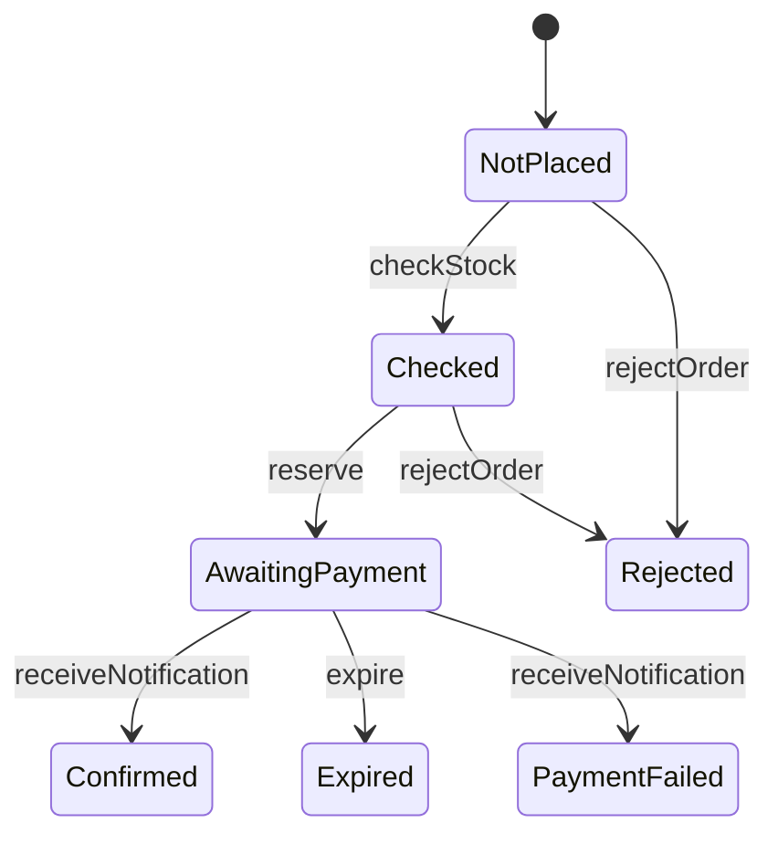

# Iteration 2：決済と時間切れ(解説)

課題の各段階について，模範解答とその考え方を示す．

## 2-1 準備

課題のディレクトリの仕様は，Iteration 1の模範解答と同じなので，検査を通る．

## 2-2 基礎知識と構文

REPLの課題の答えを示す．

```text
>>> Set(("a", true), ("b", false)).filter(p => p._2).size()
1
>>> Set(1, 2).union(Set(2, 3)).exclude(Set(1))
Set(2, 3)
>>> type Mode = On | Off
>>> if (On == Off) "same" else "different"
"different"
```

## 2-3 シナリオのテスト

決済代行サービスを，決済の状態`payment`と，送られた通知の集合`notifications`で表す．
`processPayment`は，決済の結果を非決定的に受け取り，通知を送る．
`receiveNotification`は，通知を1つ取り除き，要求文のとおりに注文を変える．
`expire`は，決済待ちの注文なら，いつでも起きうる．

```quint
// ECショップの注文処理の仕様．
module shop {
  // 注文の状態．
  type OrderStatus =
    | NotPlaced
    | Checked
    | AwaitingPayment
    | Confirmed
    | PaymentFailed
    | Expired
    | Rejected
  // 決済代行サービスでの決済の状態．
  type PaymentStatus = NotRequested | Requested | Succeeded | Failed
  // 決済の結果．
  type PaymentResult = Success | Failure

  // はじめの在庫数．
  pure val INITIAL_STOCK = 1
  // 注文．顧客ごとに1件ずつ注文する．
  pure val ORDERS = Set("o1", "o2")

  // 在庫数．
  var stock: int
  // 注文ごとの状態．
  var orderStatus: str -> OrderStatus
  // 注文ごとの，決済代行サービスでの決済の状態．
  var payment: str -> PaymentStatus
  // 決済代行サービスが送り，まだECショップが受け取っていない通知．
  var notifications: Set[(str, PaymentResult)]

  action init = all {
    stock' = INITIAL_STOCK,
    orderStatus' = ORDERS.mapBy(_ => NotPlaced),
    payment' = ORDERS.mapBy(_ => NotRequested),
    notifications' = Set(),
  }

  // 在庫があることを確かめる．
  action checkStock(order: str): bool = all {
    orderStatus.get(order) == NotPlaced,
    stock > 0,
    stock' = stock,
    orderStatus' = orderStatus.set(order, Checked),
    payment' = payment,
    notifications' = notifications,
  }

  // 引当の時点でも在庫があれば，在庫を1個引き当て，決済代行サービスに決済を依頼する．
  action reserve(order: str): bool = all {
    orderStatus.get(order) == Checked,
    stock > 0,
    stock' = stock - 1,
    orderStatus' = orderStatus.set(order, AwaitingPayment),
    payment' = payment.set(order, Requested),
    notifications' = notifications,
  }

  // 在庫がなければ，確認の前でも後でも注文を断る．
  action rejectOrder(order: str): bool = all {
    Set(NotPlaced, Checked).contains(orderStatus.get(order)),
    stock == 0,
    stock' = stock,
    orderStatus' = orderStatus.set(order, Rejected),
    payment' = payment,
    notifications' = notifications,
  }

  // 決済代行サービスが決済を行い，結果を通知する．
  action processPayment(order: str, result: PaymentResult): bool = all {
    payment.get(order) == Requested,
    stock' = stock,
    orderStatus' = orderStatus,
    payment' = payment.set(order, if (result == Success) Succeeded else Failed),
    notifications' = notifications.union(Set((order, result))),
  }

  // 決済の結果の通知を受け取る．成功なら注文を確定し，失敗なら引当を解除する．
  action receiveNotification(order: str, result: PaymentResult): bool = all {
    notifications.contains((order, result)),
    notifications' = notifications.exclude(Set((order, result))),
    payment' = payment,
    if (result == Success) all {
      stock' = stock,
      orderStatus' = orderStatus.set(order, Confirmed),
    } else all {
      stock' = stock + 1,
      orderStatus' = orderStatus.set(order, PaymentFailed),
    },
  }

  // 時間切れ監視ジョブが，決済の結果が届かない注文の引当を解除する．
  action expire(order: str): bool = all {
    orderStatus.get(order) == AwaitingPayment,
    stock' = stock + 1,
    orderStatus' = orderStatus.set(order, Expired),
    payment' = payment,
    notifications' = notifications,
  }

  action step = {
    nondet order = ORDERS.oneOf()
    nondet result = Set(Success, Failure).oneOf()
    any {
      checkStock(order),
      reserve(order),
      rejectOrder(order),
      processPayment(order, result),
      receiveNotification(order, result),
      expire(order),
    }
  }

  // 在庫は負にならない．
  val invStockNonNegative = stock >= 0

  // 決済待ちか確定した注文の数と，残りの在庫数の合計は，はじめの在庫数に等しい．
  val invStockConsistent =
    stock + ORDERS.filter(o => Set(AwaitingPayment, Confirmed).contains(orderStatus.get(o))).size()
      == INITIAL_STOCK
}
```

`reserve`のあとの注文の状態が`AwaitingPayment`になるので，`placeOneOrderTest`の期待値を直す．

```quint
  // 在庫が1個のとき，注文を1件受け付けると在庫は0個になる．
  run placeOneOrderTest =
    init
      .then(checkStock("o1"))
      .then(reserve("o1"))
      .expect(stock == 0 and orderStatus.get("o1") == AwaitingPayment)
```

要求文の2つの例は，次の3つのテストにする．
2つ目の例は，決済の失敗と時間切れの2つの場合を含むので，テストを分ける．

```quint
  // 決済が成功すると，注文は確定し，在庫は0個のままである．
  run confirmOnSuccessTest =
    init
      .then(checkStock("o1"))
      .then(reserve("o1"))
      .then(processPayment("o1", Success))
      .then(receiveNotification("o1", Success))
      .expect(stock == 0 and orderStatus.get("o1") == Confirmed)

  // 決済が失敗すると，引当を解除し，在庫は1個に戻る．
  run releaseOnFailureTest =
    init
      .then(checkStock("o1"))
      .then(reserve("o1"))
      .then(processPayment("o1", Failure))
      .then(receiveNotification("o1", Failure))
      .expect(stock == 1 and orderStatus.get("o1") == PaymentFailed)

  // 決済の結果が届かないまま時間切れになると，引当を解除し，在庫は1個に戻る．
  run releaseOnExpireTest =
    init
      .then(checkStock("o1"))
      .then(reserve("o1"))
      .then(expire("o1"))
      .expect(stock == 1 and orderStatus.get("o1") == Expired)
```

```text
$ quint test shop_test.qnt

  shop_test
    ok placeOneOrderTest passed 1 test(s)
    ok rejectWhenOutOfStockTest passed 1 test(s)
    ok rejectAfterCheckTest passed 1 test(s)
    ok confirmOnSuccessTest passed 1 test(s)
    ok releaseOnFailureTest passed 1 test(s)
    ok releaseOnExpireTest passed 1 test(s)

  6 passing (86ms)
```

## 2-4 性質

要求文の「引当を解除する」は，引き当てた在庫を残りの在庫に戻すことである．
在庫を引き当てている注文は，決済待ちの注文と確定した注文である．
その数と残りの在庫数の合計は，いつもはじめの在庫数に等しいはずである．

```quint
  // 決済待ちか確定した注文の数と，残りの在庫数の合計は，はじめの在庫数に等しい．
  val invStockConsistent =
    stock + ORDERS.filter(o => Set(AwaitingPayment, Confirmed).contains(orderStatus.get(o))).size()
      == INITIAL_STOCK
```

## 2-5 検査と反例

`quint run`は，`invStockConsistent`が破れる実行を見つける．
出力は長いので，最後の2つの状態だけを示す．

```text
$ quint run shop.qnt --invariants invStockNonNegative invStockConsistent --max-samples=1000 --seed=1
...
[State 8]
{
  notifications: Set(("o1", Success), ("o2", Success)),
  orderStatus: Map("o1" -> Expired, "o2" -> Expired),
  payment: Map("o1" -> Succeeded, "o2" -> Succeeded),
  stock: 1
}

[State 9]
{
  notifications: Set(("o2", Success)),
  orderStatus: Map("o1" -> Confirmed, "o2" -> Expired),
  payment: Map("o1" -> Succeeded, "o2" -> Succeeded),
  stock: 1
}

[violation] Found an issue (39ms at 26 traces/second).
  ❌ invStockConsistent
Use --verbosity=3 to show executions.
Use --seed=0x1 --backend=rust to reproduce.
error: Invariant violated
```

`quint verify`は，より短い反例を示す．

```text
$ quint verify shop.qnt --invariants invStockNonNegative invStockConsistent
An example execution:

[State 0]
{
  notifications: Set(),
  orderStatus: Map("o1" -> NotPlaced, "o2" -> NotPlaced),
  payment: Map("o1" -> NotRequested, "o2" -> NotRequested),
  stock: 1
}

[State 1]
{
  notifications: Set(),
  orderStatus: Map("o1" -> NotPlaced, "o2" -> Checked),
  payment: Map("o1" -> NotRequested, "o2" -> NotRequested),
  stock: 1
}

[State 2]
{
  notifications: Set(),
  orderStatus: Map("o1" -> NotPlaced, "o2" -> AwaitingPayment),
  payment: Map("o1" -> NotRequested, "o2" -> Requested),
  stock: 0
}

[State 3]
{
  notifications: Set(),
  orderStatus: Map("o1" -> NotPlaced, "o2" -> Expired),
  payment: Map("o1" -> NotRequested, "o2" -> Requested),
  stock: 1
}

[State 4]
{
  notifications: Set(("o2", Success)),
  orderStatus: Map("o1" -> NotPlaced, "o2" -> Expired),
  payment: Map("o1" -> NotRequested, "o2" -> Succeeded),
  stock: 1
}

[State 5]
{
  notifications: Set(),
  orderStatus: Map("o1" -> NotPlaced, "o2" -> Confirmed),
  payment: Map("o1" -> NotRequested, "o2" -> Succeeded),
  stock: 1
}

[violation] Found an issue (6258ms).
  ❌ invStockConsistent
error: found a counterexample
```

問いへの答えは次のとおりである．

1. 最後の状態では，在庫が1個残っているのに，確定した注文も1件ある．合計が2になり，はじめの在庫数1より多い．この在庫をほかの顧客が注文すると，売り越しになる．
2. Bさん(`o2`)の注文で，在庫の確認，引当と決済の依頼，時間切れ，決済(成功)，通知の受け取りの順に起きた．
3. 通知を受け取った時点で，注文はすでに`Expired`だった．時間切れで在庫は戻っていた．
4. 要求文は「成功なら注文を確定する」と書くが，時間切れになった注文へ成功の通知が届いた場合を決めていない．失敗の通知が届いた場合も同じである．
5. 決済代行サービスの処理が遅れた場合や，通知の送信が遅れた場合に起きる．時間切れの設定を長くしても，遅れがそれより長ければ起きる．

## 2-6 決定と反映

時間切れになった注文は，成功の通知が届いても確定せず，返金すると決める．
失敗の通知が届いたときは，すでに引当を解除しているので，何もしない．

```markdown
### Iteration 2

- 決済の結果の通知は，時間切れのあとに届くことがある．時間切れになった注文は，成功の通知が届いても確定せず，返金する．失敗の通知が届いても，引当を二重に解除しない．(性質：invStockConsistent)
```

決済の状態に，返金した状態`Refunded`を加える．
`receiveNotification`は，通知を受け取った時点の注文の状態を確かめてから動く．

```quint
  // 決済の結果の通知を受け取る．
  // 決済待ちの注文は，成功なら確定し，失敗なら引当を解除する．
  // 時間切れになった注文は，成功なら返金し，失敗なら何もしない．
  action receiveNotification(order: str, result: PaymentResult): bool = all {
    notifications.contains((order, result)),
    notifications' = notifications.exclude(Set((order, result))),
    if (orderStatus.get(order) == AwaitingPayment and result == Success) all {
      stock' = stock,
      orderStatus' = orderStatus.set(order, Confirmed),
      payment' = payment,
    } else if (orderStatus.get(order) == AwaitingPayment and result == Failure) all {
      stock' = stock + 1,
      orderStatus' = orderStatus.set(order, PaymentFailed),
      payment' = payment,
    } else if (orderStatus.get(order) == Expired and result == Success) all {
      stock' = stock,
      orderStatus' = orderStatus,
      payment' = payment.set(order, Refunded),
    } else all {
      stock' = stock,
      orderStatus' = orderStatus,
      payment' = payment,
    },
  }
```

決めた振る舞いを確かめるテストを加える．

```quint
  // 時間切れのあとに成功の通知が届くと，注文は確定せずに返金する．在庫は1個のままである．
  run refundAfterExpireTest =
    init
      .then(checkStock("o1"))
      .then(reserve("o1"))
      .then(expire("o1"))
      .then(processPayment("o1", Success))
      .then(receiveNotification("o1", Success))
      .expect(stock == 1 and orderStatus.get("o1") == Expired and payment.get("o1") == Refunded)

  // 時間切れのあとに失敗の通知が届いても，在庫は1個のままである．
  run ignoreFailureAfterExpireTest =
    init
      .then(checkStock("o1"))
      .then(reserve("o1"))
      .then(expire("o1"))
      .then(processPayment("o1", Failure))
      .then(receiveNotification("o1", Failure))
      .expect(stock == 1 and orderStatus.get("o1") == Expired)
```

状態遷移図は次のようになる．
`Expired`からの遷移はない．時間切れのあとの通知は，注文の状態を変えないからである．



```text
$ mise run verify iterations/iteration-2/exercise
[install] $ pnpm install --frozen-lockfile
✓ Lockfile passes supply-chain policies (verified 21m ago)
Lockfile is up to date, resolution step is skipped
Done in 20ms using pnpm v12.6.0
[verify] $ node tools/check.ts iterations/iteration-2/exercise
ok  Quintの評価器とApalache

iterations/iteration-2/exercise
ok  quint typecheck
ok  quint test
ok  性質名の照合
ok  quint verify
ok  状態遷移図
Finished in 38.35s
```

## 2-7 振り返り

1. 顧客から見ると，模範解答の決定では「支払ったのに注文が取り消され，返金された」ように見える．顧客への連絡が別に必要になる．
   2-8の決定では，在庫が残っていれば注文が確定するので，顧客にとっての不都合は減る．その代わりに，処理は複雑になる．
2. 2つのテストは，それぞれ1つの出来事(時間切れ，または成功の通知)だけを扱っていた．2つの出来事が両方起きる順番は，どのテストにもなかった．
3. 決済が失敗する場合と，失敗の通知が時間切れのあとに届く場合の問題が見つからなかった．失敗の通知で引当を二重に解除すると，在庫が増える．
4. `Expired`の注文の状態は，その後変わらない．返金は決済の状態`payment`の変化なので，状態遷移図には現れない．シナリオのテスト`refundAfterExpireTest`と，不変条件で確かめる．

## 2-8 発展課題

時間切れのあとの成功の通知で，在庫が残っていれば確定する場合は，`receiveNotification`に次の場合を加える．
在庫を1個減らして注文を確定し，在庫がなければ返金する．

```quint
    } else if (orderStatus.get(order) == Expired and result == Success and stock > 0) all {
      stock' = stock - 1,
      orderStatus' = orderStatus.set(order, Confirmed),
      payment' = payment,
    } else if (orderStatus.get(order) == Expired and result == Success) all {
      stock' = stock,
      orderStatus' = orderStatus,
      payment' = payment.set(order, Refunded),
    } else all {
```

この仕様でも，`invStockNonNegative`と`invStockConsistent`は成り立つ．

```text
$ quint verify shop.qnt --invariants invStockNonNegative invStockConsistent --apalache-config=../../../tools/apalache.json
[ok] No violation found (50235ms).
You may increase --max-steps.
Use --verbosity to produce more (or less) output.
```

どちらの決定も，在庫の不変条件を満たす．
どちらを選ぶかは，顧客への影響と実装の複雑さを比べて決める．
