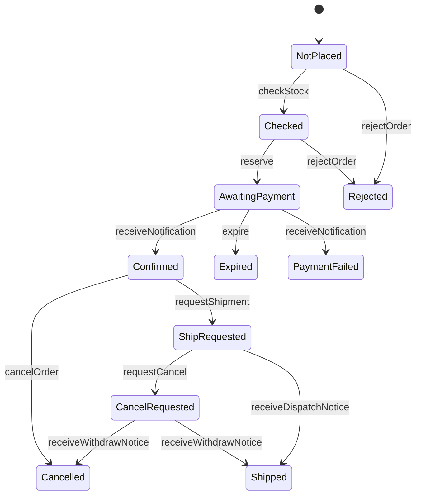

# Iteration 5：キャンセルと出荷(解説)

課題の各段階について，模範解答とその考え方を示す．

## 5-1 準備

課題のディレクトリの仕様は，Iteration 4の模範解答と同じなので，検査を通る．

## 5-2 基礎知識と構文

1. 予約システムが「取消済み」，台帳が「貸出中」の間に，同じ本の予約を別の利用者に回さない．台帳の事実(貸出中)が届くまで，その本は利用できないものとして扱う．
2. 例として，ホテルの予約のキャンセルがある．チェックインが済んでいれば，キャンセルという補償処理は失敗する．その場合に料金をどう扱うかを決めておく必要がある．

## 5-3 シナリオのテスト

配送システムの出荷の状態`shipment`と，発送の通知`dispatchNotices`を加え，出荷とキャンセルのアクションを書く．
要求文の「出荷されるまでキャンセルできる」は，ECショップの状態が`Confirmed`か`ShipRequested`のときにキャンセルできる，と読んで書く．

```quint
  // 出荷連携が，確定した注文の出荷を配送システムに指示する．
  action requestShipment(order: str): bool = all {
    orderStatus.get(order) == Confirmed,
    stock' = stock,
    orderStatus' = orderStatus.set(order, ShipRequested),
    attempts' = attempts,
    requests' = requests,
    charges' = charges,
    refunds' = refunds,
    paymentRecord' = paymentRecord,
    notifications' = notifications,
    shipment' = shipment.set(order, Instructed),
    dispatchNotices' = dispatchNotices,
  }

  // 配送システムが，指示された商品を発送し，発送を通知する．
  action dispatch(order: str): bool = all {
    shipment.get(order) == Instructed,
    stock' = stock,
    orderStatus' = orderStatus,
    attempts' = attempts,
    requests' = requests,
    charges' = charges,
    refunds' = refunds,
    paymentRecord' = paymentRecord,
    notifications' = notifications,
    shipment' = shipment.set(order, Dispatched),
    dispatchNotices' = dispatchNotices.union(Set(order)),
  }

  // 発送の通知を受け取り，出荷を指示した注文を出荷済みにする．
  action receiveDispatchNotice(order: str): bool = all {
    dispatchNotices.contains(order),
    stock' = stock,
    orderStatus' = if (orderStatus.get(order) == ShipRequested) orderStatus.set(order, Shipped) else orderStatus,
    attempts' = attempts,
    requests' = requests,
    charges' = charges,
    refunds' = refunds,
    paymentRecord' = paymentRecord,
    notifications' = notifications,
    shipment' = shipment,
    dispatchNotices' = dispatchNotices,
  }

  // 顧客が，出荷される前の注文をキャンセルする．返金し，在庫を戻す．
  action cancelOrder(order: str): bool = all {
    Set(Confirmed, ShipRequested).contains(orderStatus.get(order)),
    stock' = stock + 1,
    orderStatus' = orderStatus.set(order, Cancelled),
    attempts' = attempts,
    requests' = requests,
    charges' = charges,
    refunds' = refunds.set(order, refunds.get(order) + 1),
    paymentRecord' = paymentRecord,
    notifications' = notifications,
    shipment' = shipment,
    dispatchNotices' = dispatchNotices,
  }
```

要求文の2つの例をテストにする．

```quint
  // 確定した注文をキャンセルすると，返金され，在庫は1個に戻る．
  run cancelConfirmedTest =
    init
      .then(checkStock("o1"))
      .then(reserve("o1"))
      .then(processPayment("o1", Success))
      .then(receiveNotification("o1", Success))
      .then(cancelOrder("o1"))
      .expect(orderStatus.get("o1") == Cancelled and refunds.get("o1") == 1 and stock == 1)

  // 確定した注文は，出荷を指示され，配送システムが発送すると出荷済みになる．
  run shipConfirmedTest =
    init
      .then(checkStock("o1"))
      .then(reserve("o1"))
      .then(processPayment("o1", Success))
      .then(receiveNotification("o1", Success))
      .then(requestShipment("o1"))
      .then(dispatch("o1"))
      .then(receiveDispatchNotice("o1"))
      .expect(orderStatus.get("o1") == Shipped and shipment.get("o1") == Dispatched)
```

```text
$ quint test shop_test.qnt
...
  13 passing (430ms)
```

## 5-4 性質

新しい性質を加えずに検査すると，Iteration 2と4の性質が破れる．
`invStockConsistent`の反例は，最後の2つの状態で，確定した注文の出荷を指示したところで終わる．

```text
$ quint verify shop.qnt --invariants invStockConsistent --apalache-config=../../../tools/apalache.json
...
[State 4]
{
  attempts: Map("o1" -> 0, "o2" -> 1),
  charges: Map("o1" -> 0, "o2" -> 1),
  dispatchNotices: Set(),
  notifications: Set(("o2", Success)),
  orderStatus: Map("o1" -> NotPlaced, "o2" -> Confirmed),
  paymentRecord: Map("o1" -> NotProcessed, "o2" -> Processed(Success)),
  refunds: Map("o1" -> 0, "o2" -> 0),
  requests: Map("o1" -> 0, "o2" -> 0),
  shipment: Map("o1" -> NotInstructed, "o2" -> NotInstructed),
  stock: 0
}

[State 5]
{
  attempts: Map("o1" -> 0, "o2" -> 1),
  charges: Map("o1" -> 0, "o2" -> 1),
  dispatchNotices: Set(),
  notifications: Set(("o2", Success)),
  orderStatus: Map("o1" -> NotPlaced, "o2" -> ShipRequested),
  paymentRecord: Map("o1" -> NotProcessed, "o2" -> Processed(Success)),
  refunds: Map("o1" -> 0, "o2" -> 0),
  requests: Map("o1" -> 0, "o2" -> 0),
  shipment: Map("o1" -> NotInstructed, "o2" -> Instructed),
  stock: 0
}

[violation] Found an issue (8622ms).
error: found a counterexample
```

`livePaidOrderSettles`の反例は，出荷済みの注文で止まり続ける．

```text
$ quint verify --backend=tlc shop.qnt --temporal=livePaidOrderSettles
...
State 15: <receiveDispatchNotice line 406, col 3 to line 419, col 42 of module shop>
/\ charges = [o1 |-> 1, o2 |-> 1]
/\ stock = 0
/\ attempts = [o1 |-> 1, o2 |-> 2]
/\ notifications = { <<"o1", [Success |-> [tag |-> "UNIT"]]>>,
  <<"o2", [Success |-> [tag |-> "UNIT"]]>> }
/\ requests = [o1 |-> 0, o2 |-> 0]
/\ dispatchNotices = {"o1"}
/\ shipment = [ o1 |-> [Dispatched |-> [tag |-> "UNIT"]],
  o2 |-> [NotInstructed |-> [tag |-> "UNIT"]] ]
/\ refunds = [o1 |-> 0, o2 |-> 1]
/\ paymentRecord = [ o1 |-> [Processed |-> [Success |-> [tag |-> "UNIT"]]],
  o2 |-> [Processed |-> [Success |-> [tag |-> "UNIT"]]] ]
/\ orderStatus = [o1 |-> [Shipped |-> [tag |-> "UNIT"]], o2 |-> [Expired |-> [tag |-> "UNIT"]]]

State 16: Stuttering
Finished checking temporal properties in 00s at 2026-09-27 05:53:08
10149 states generated, 1711 distinct states found, 0 states left on queue.
Finished in 00s at (2026-09-27 05:53:08)

[violation] Found an issue (1265ms).
error: found a counterexample
```

どちらも，仕様の誤りではない．性質の定義が，新しい状態に追いついていない．

- `invStockConsistent`は，在庫を引き当てている注文を「決済待ちか確定」と数えていた．出荷を指示した注文と出荷済みの注文も，在庫を引き当てている．
- `unsettled`は，「確定」以外を未決着と数えていた．出荷を指示した注文と出荷済みの注文も，商品を受け取る側に決着している．

要求文の「確定」「引き当てる」の意味を，新しい状態を含めて決め直し，性質を直す．

```quint
  // 在庫を引き当てている注文(決済待ち，確定，出荷指示済み，出荷済み，取消依頼中)の数と，残りの在庫数の合計は，はじめの在庫数に等しい．
  val invStockConsistent =
    stock + ORDERS.filter(o => Set(AwaitingPayment, Confirmed, ShipRequested, Shipped, CancelRequested).contains(orderStatus.get(o))).size()
      == INITIAL_STOCK
```

```quint
  // 支払いを済ませ，商品を受け取る状態(確定，出荷指示済み，出荷済み)にも，返金された状態にもなっていない注文．
  def unsettled(o: str): bool =
    charges.get(o) > refunds.get(o) and not(Set(Confirmed, ShipRequested, Shipped).contains(orderStatus.get(o)))
```

そのうえで，返金と発送の両方が起きないことを不変条件にする．

```quint
  // 返金した注文の商品は，発送しない．
  val invNoRefundAndDispatch = ORDERS.forall(o => not(refunds.get(o) > 0 and shipment.get(o) == Dispatched))
```

## 5-5 検査と反例

最後の2つの状態を示す．

```text
$ quint verify shop.qnt --invariants invNoRefundAndDispatch --apalache-config=../../../tools/apalache.json
...
[State 6]
{
  attempts: Map("o1" -> 0, "o2" -> 1),
  charges: Map("o1" -> 0, "o2" -> 1),
  dispatchNotices: Set(),
  notifications: Set(("o2", Success)),
  orderStatus: Map("o1" -> NotPlaced, "o2" -> Cancelled),
  paymentRecord: Map("o1" -> NotProcessed, "o2" -> Processed(Success)),
  refunds: Map("o1" -> 0, "o2" -> 1),
  requests: Map("o1" -> 0, "o2" -> 0),
  shipment: Map("o1" -> NotInstructed, "o2" -> Instructed),
  stock: 1
}

[State 7]
{
  attempts: Map("o1" -> 0, "o2" -> 1),
  charges: Map("o1" -> 0, "o2" -> 1),
  dispatchNotices: Set("o2"),
  notifications: Set(("o2", Success)),
  orderStatus: Map("o1" -> NotPlaced, "o2" -> Cancelled),
  paymentRecord: Map("o1" -> NotProcessed, "o2" -> Processed(Success)),
  refunds: Map("o1" -> 0, "o2" -> 1),
  requests: Map("o1" -> 0, "o2" -> 0),
  shipment: Map("o1" -> NotInstructed, "o2" -> Dispatched),
  stock: 1
}

[violation] Found an issue (11085ms).
error: found a counterexample
```

問いへの答えは次のとおりである．

1. ECショップでは注文が`Cancelled`で返金済み，配送システムでは`Dispatched`(発送済み)である．
2. 出荷を指示したあと，顧客がキャンセルし，ECショップは返金した．配送システムはキャンセルを知らないまま，指示どおりに発送した．
3. 顧客がキャンセルできるかは，ECショップの状態(`ShipRequested`)で判断していた．しかし，実際に商品が出荷されたかは，配送システムの状態で決まる．要求文の「出荷されるまで」は，どちらの状態で判断するかを決めていない．

## 5-6 決定と反映

出荷を指示したあとは，ECショップだけでは発送を止められない．
そこで，出荷を指示する前のキャンセルはその場で受け付け，指示したあとのキャンセルは配送システムへの取消依頼にする．
取消依頼中の状態`CancelRequested`，配送システムの取消の状態`Withdrawn`，取消依頼`cancelRequests`と応答`withdrawNotices`を加える．

```quint
  // 顧客が，出荷を指示した注文をキャンセルする．配送システムに取消を依頼する．
  action requestCancel(order: str): bool = all {
    orderStatus.get(order) == ShipRequested,
    stock' = stock,
    orderStatus' = orderStatus.set(order, CancelRequested),
    attempts' = attempts,
    requests' = requests,
    charges' = charges,
    refunds' = refunds,
    paymentRecord' = paymentRecord,
    notifications' = notifications,
    shipment' = shipment,
    dispatchNotices' = dispatchNotices,
    cancelRequests' = cancelRequests.union(Set(order)),
    withdrawNotices' = withdrawNotices,
  }

  // 配送システムが取消依頼を処理する．発送前なら取り消し，発送済みなら断る．
  action withdraw(order: str): bool = all {
    cancelRequests.contains(order),
    Set(Instructed, Dispatched, Withdrawn).contains(shipment.get(order)),
    stock' = stock,
    orderStatus' = orderStatus,
    attempts' = attempts,
    requests' = requests,
    charges' = charges,
    refunds' = refunds,
    paymentRecord' = paymentRecord,
    notifications' = notifications,
    shipment' = if (shipment.get(order) == Dispatched) shipment else shipment.set(order, Withdrawn),
    dispatchNotices' = dispatchNotices,
    cancelRequests' = cancelRequests,
    withdrawNotices' = withdrawNotices.union(Set((order, if (shipment.get(order) == Dispatched) WithdrawRefused else WithdrawDone))),
  }

  // 取消依頼への応答を受け取る．
  // 取り消せたら，注文をキャンセルし，返金して在庫を戻す．
  // 発送済みで取り消せなかったら，注文を出荷済みにする．返金はしない．
  action receiveWithdrawNotice(order: str, result: WithdrawResult): bool = all {
    withdrawNotices.contains((order, result)),
    attempts' = attempts,
    requests' = requests,
    charges' = charges,
    paymentRecord' = paymentRecord,
    notifications' = notifications,
    shipment' = shipment,
    dispatchNotices' = dispatchNotices,
    cancelRequests' = cancelRequests,
    withdrawNotices' = withdrawNotices,
    if (orderStatus.get(order) == CancelRequested and result == WithdrawDone) all {
      stock' = stock + 1,
      orderStatus' = orderStatus.set(order, Cancelled),
      refunds' = refunds.set(order, refunds.get(order) + 1),
    } else if (orderStatus.get(order) == CancelRequested and result == WithdrawRefused) all {
      stock' = stock,
      orderStatus' = orderStatus.set(order, Shipped),
      refunds' = refunds,
    } else all {
      stock' = stock,
      orderStatus' = orderStatus,
      refunds' = refunds,
    },
  }
```

食い違いがいずれ解消されることを，時相論理の性質として書き，配送システムについての公平性を仮定する．

```quint
  // 配送システムは，取消依頼に応答し，その応答と発送の通知はいずれ必ず受け取られる．
  temporal logisticsIsFair =
    ORDERS.forall(o =>
      weakFair(withdraw(o), vars)
        and weakFair(receiveDispatchNotice(o), vars)
        and Set(WithdrawDone, WithdrawRefused).forall(r => weakFair(receiveWithdrawNotice(o, r), vars)))

  // 取消依頼中の注文は，いずれキャンセル済みか出荷済みになる．
  temporal liveCancelRequestSettles =
    logisticsIsFair implies
      ORDERS.forall(o => always(orderStatus.get(o) == CancelRequested implies eventually(Set(Cancelled, Shipped).contains(orderStatus.get(o)))))

  // 配送システムで発送された注文は，いずれECショップでも出荷済みになる．
  temporal liveDispatchedBecomesShipped =
    logisticsIsFair implies
      ORDERS.forall(o => always(shipment.get(o) == Dispatched implies eventually(orderStatus.get(o) == Shipped)))
```

`receiveWithdrawNotice`に「取り消せた場合」だけを書いた段階では，公平性を仮定しても`liveCancelRequestSettles`が破れる．
最後の2つの状態を示す．

```text
$ quint verify --backend=tlc shop.qnt --temporal=liveCancelRequestSettles
...
State 13: <withdraw line 264, col 3 to line 286, col 12 of module shop>
/\ charges = [o1 |-> 0, o2 |-> 1]
/\ stock = 0
/\ attempts = [o1 |-> 1, o2 |-> 1]
/\ notifications = { <<"o1", [Failure |-> [tag |-> "UNIT"]]>>,
  <<"o2", [Success |-> [tag |-> "UNIT"]]>> }
/\ cancelRequests = {"o2"}
/\ requests = [o1 |-> 0, o2 |-> 0]
/\ dispatchNotices = {"o2"}
/\ shipment = [ o1 |-> [NotInstructed |-> [tag |-> "UNIT"]],
  o2 |-> [Dispatched |-> [tag |-> "UNIT"]] ]
/\ refunds = [o1 |-> 0, o2 |-> 0]
/\ withdrawNotices = {<<"o2", [WithdrawRefused |-> [tag |-> "UNIT"]]>>}
/\ paymentRecord = [ o1 |-> [Processed |-> [Failure |-> [tag |-> "UNIT"]]],
  o2 |-> [Processed |-> [Success |-> [tag |-> "UNIT"]]] ]
/\ orderStatus = [ o1 |-> [PaymentFailed |-> [tag |-> "UNIT"]],
  o2 |-> [CancelRequested |-> [tag |-> "UNIT"]] ]

State 14: Stuttering
Finished checking temporal properties in 00s at 2026-09-27 05:53:29
25597 states generated, 1996 distinct states found, 0 states left on queue.
Finished in 00s at (2026-09-27 05:53:29)

[violation] Found an issue (1390ms).
error: found a counterexample
```

配送システムは発送済みなので取消を断り(`WithdrawRefused`)，その応答は受け取られている．
しかし，断られた場合の振る舞いがないので，注文は`CancelRequested`のまま止まる．
公平性の不足ではなく，振る舞いの抜けである．
そこで，取り消せなかったら出荷済みにし，返金しないと決める(上の`receiveWithdrawNotice`の`WithdrawRefused`の場合)．

```markdown
### Iteration 5

- 出荷を指示したあとは，ECショップだけでは発送を止められない．出荷を指示する前のキャンセルはその場で受け付け，指示したあとのキャンセルは配送システムへの取消依頼にする．取り消せたときだけ返金する．(性質：invNoRefundAndDispatch)
- 取消依頼が届く前に発送されていたら，配送システムは取消を断る．その注文は出荷済みにし，返金しない．顧客には取り消せなかったことを連絡する．(性質：liveCancelRequestSettles，liveDispatchedBecomesShipped)
- 配送システムは取消依頼に必ず応答し，その応答と発送の通知はいずれ必ず受け取られる．(性質：liveCancelRequestSettles，liveDispatchedBecomesShipped)
```

決めた振る舞いを確かめるテストを加える．

```quint
  // 出荷を指示したあとのキャンセルは，配送システムが取り消せたら，返金して在庫を戻す．
  run cancelAfterShipRequestTest =
    init
      .then(checkStock("o1"))
      .then(reserve("o1"))
      .then(processPayment("o1", Success))
      .then(receiveNotification("o1", Success))
      .then(requestShipment("o1"))
      .then(requestCancel("o1"))
      .then(withdraw("o1"))
      .then(receiveWithdrawNotice("o1", WithdrawDone))
      .expect(orderStatus.get("o1") == Cancelled and refunds.get("o1") == 1 and shipment.get("o1") == Withdrawn)

  // 取消依頼が届く前に発送されていたら，注文は出荷済みになり，返金しない．
  run cancelTooLateTest =
    init
      .then(checkStock("o1"))
      .then(reserve("o1"))
      .then(processPayment("o1", Success))
      .then(receiveNotification("o1", Success))
      .then(requestShipment("o1"))
      .then(dispatch("o1"))
      .then(requestCancel("o1"))
      .then(withdraw("o1"))
      .then(receiveWithdrawNotice("o1", WithdrawRefused))
      .expect(orderStatus.get("o1") == Shipped and refunds.get("o1") == 0)
```

状態遷移図は次のようになる．
`CancelRequested`からは，配送システムの応答によって`Cancelled`か`Shipped`に進む．



```text
$ mise run verify iterations/iteration-5/exercise
[install] $ pnpm install --frozen-lockfile
✓ Lockfile passes supply-chain policies (verified 1h ago)
Lockfile is up to date, resolution step is skipped
Done in 23ms using pnpm v12.6.0
[verify] $ node tools/check.ts iterations/iteration-5/exercise
ok  Quintの評価器とApalache

iterations/iteration-5/exercise
ok  quint typecheck
ok  quint test
ok  性質名の照合
ok  quint verify
ok  quint verify(時相論理の性質)
ok  状態遷移図
Finished in 23.19s
```

## 5-7 振り返り

1. 取り消せなかった顧客には，キャンセルできなかったことと，商品が届くことを伝える．返品の手続きを案内する必要もある．
2. 新しい状態によって，「確定」「引き当てる」の意味が広がった．性質は要求文の言葉を式にしたものなので，言葉の意味が変われば性質も直す．
3. 配送システムの応答は届いていたが，ECショップがその応答を扱っていなかった．公平性をいくら仮定しても直らない，振る舞いの抜けである．
4. `CancelRequested`からは，`receiveWithdrawNotice`で`Cancelled`か`Shipped`に進む．止まり続ける遷移はない．

## 5-8 発展課題

出荷を指示したあとのキャンセルを受け付けない場合は，`cancelOrder`の条件を`Confirmed`だけにし，取消の依頼を加えない．
仕様は単純になり，`invNoRefundAndDispatch`も成り立つ．
その代わりに，出荷の指示から発送までの間は，顧客はキャンセルできない．
出荷の指示がすぐ行われる運用なら，顧客がキャンセルできる時間はほとんどなくなる．
