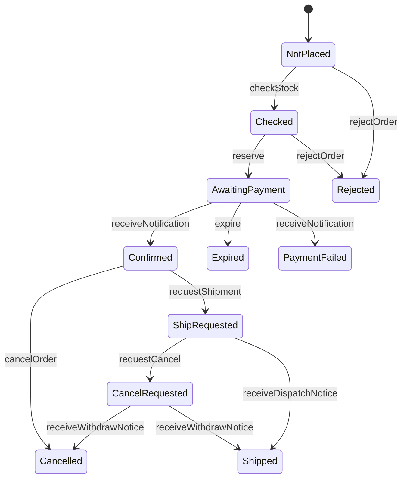

# 状態遷移図

注文の状態(`orderStatus`)がどのアクションでどう変わるかを示す．
このファイルは，仕様のトレースから`mise run diagram`で生成する．手で編集しない．

```mermaid
stateDiagram-v2
  [*] --> NotPlaced
  AwaitingPayment --> Confirmed : receiveNotification
  AwaitingPayment --> Expired : expire
  AwaitingPayment --> PaymentFailed : receiveNotification
  CancelRequested --> Cancelled : receiveWithdrawNotice
  CancelRequested --> Shipped : receiveWithdrawNotice
  Checked --> AwaitingPayment : reserve
  Checked --> Rejected : rejectOrder
  Confirmed --> Cancelled : cancelOrder
  Confirmed --> ShipRequested : requestShipment
  NotPlaced --> Checked : checkStock
  NotPlaced --> Rejected : rejectOrder
  ShipRequested --> CancelRequested : requestCancel
  ShipRequested --> Shipped : receiveDispatchNotice
```
